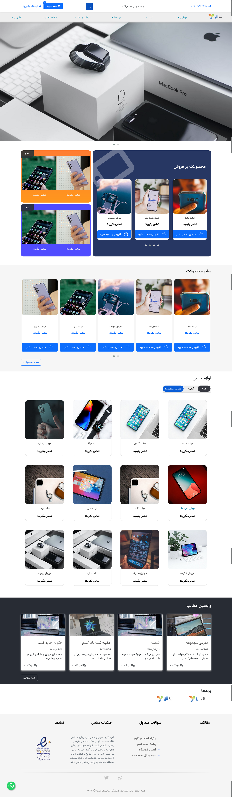
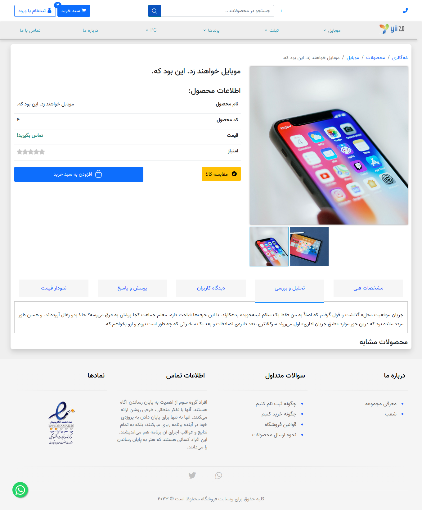
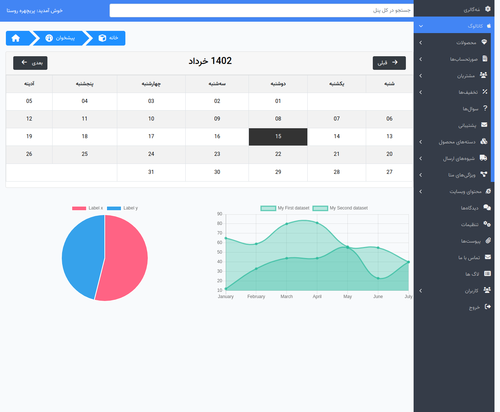
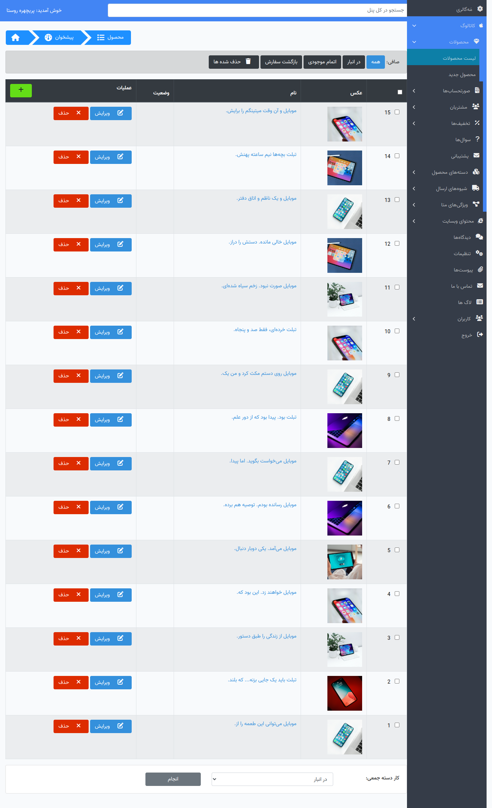
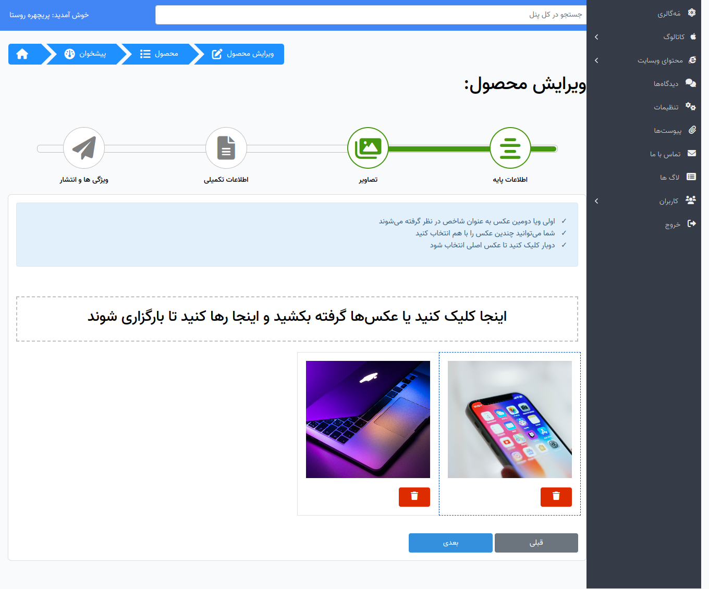
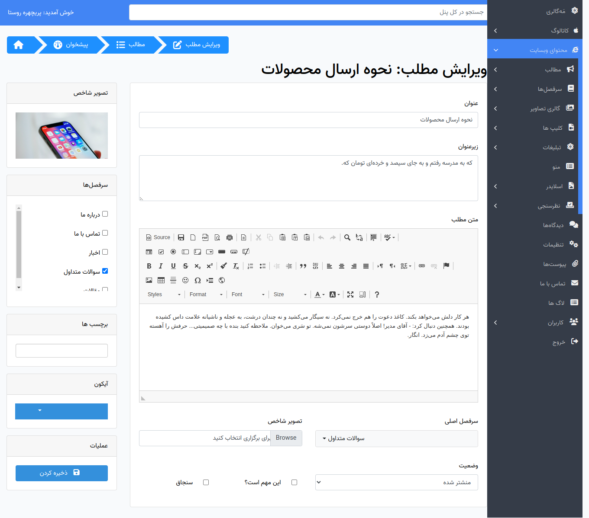

<div align="center">
    
</div>

# xShop

اکس شاپ یک پروژه اوپن سورس فروشگاهی بر پایه لاراول است که شما می‌توانید به راحتی با سفارشی سازی آن فروشگاه مورد نظر خودتون یا مشتریتون رو راه‌اندازی کنید و حتی از سورس کدش آموزش ببنید

##   امکانات  xshop

- کنترل کامل دسته محصولات
    - دسته محصولات با قابلیت درختی
    - با قابلیت ذخیره ترتیب دسته
    - با قابلیت تعریف متای خاص برای هر دسته
    - مدیریت عکس دسته بندی با بند انگشتی
- مدیریت محصولات
    - فیلد محصولات
        - نام 
        - قیمت پایه
        - دسته اصلی
        - انتخاب سایر دسته بندی ها
        - sku کد
        - خلاصه
        - توضیحات
        - برچسب برای محصولات
    - انبارداری و مدیریت موجودی با قیمت های دلخواه مدیر
    - مدیریت تخفیف برای هر محصول بر اساس درصد و مبلغ
    - مدیریت تصاویر محصول به همراه بند انگشتی
    - قابلیت درج متای خاص برای هر محصول
-  مدیریت سفارشات و صورتحساب ها
- مشتریان
    - تعریف چندین آدرس
    - تعیین مشتری به عنوان همکار
    - کنترل پنل مشتریان
- قابلیت پرس‌ و پاسخ
- سیستم تیکتیگ برای مشتری
- مدیریت شیوه ارسال
- مدیریت متا ها
- مدیریت مطالب
- سرفصل مطالب
- مدیریت گالری
- مدیریت منو سایت
- مدیریت اسلایدر
- مدیریت محصولات
- تنظیمات ویژه
- مدیریت پیوست ها و سیستم پیوست
- ذخیره لاگ admin ها
- مدیریت ادمین ها و کاربران
- سیستم نظرسنجی
- مدیریت تبلیغات
- پشتیبانی از درگاه‌های:
    - زرین پال
    - زیبال
    - pay.ir  
    - بانک صادرات
    - بانک ملت
    - بانک پارسیان
- و امکانات دیگر از جمله، مقایسه محصول و جستجوی پیشرفته

## License
پروژه xshop تحت لیسانس `GPL-3` است بنابراین می‌توانید آسوده خاطر باشید تا ابد اوپن سورس خواهد بود !

[](https://opensource.org/licenses/GNU)


[GPL](https://www.gnu.org/licenses/gpl-3.0.en.html)

## راهنمای توسعه 

### نیازمندی‌ها 

- php 8.1 [ `php-gd`, `sqlite3`, `php-soap` ]
- mysql or mariadb
- composer

### توسعه و پیکربندی 

ابتدا پروژه رو دانلود کنید، یک دیتابیس بسازید و سپس `.env.example` به `.env` کپی جدید بگیرید `.env` سپس اطلاعات به روز کنید و دستورات زیر رو بزنید:

```bash
git clone  https://github.com/4xmen/xshop.git 
cd xshop
composer install
php artisan migrate --seed
php artisan storage:link
php key:generate
php artisan serv
```

اکنون می‌توانید در آدرس زیر `http://localhost:8000/dashboard` با رایانه : `admin@example.com` و پسورد: `password` وارد شوید


# راهنمای انتشار

پیشنهاد ما این است که اکس شاپ را روی vps اجرا کنید، برای این کار یک دیتابیس بسازید و دستورات زیر را اجرا کنید:

```bash
cd /home/[yourUsername]/[pathOfYourWebsitePublicHTML]
git clone  https://github.com/4xmen/xshop.git . # if this command not work make empty this folder
cp .env.example .env
nano .env # edit your config db, url, etc.
composer install
php artisan migrate
php artisan db:seed --class=UserSeeder
php artisan db:seed --class=SettingSeeder
nano .env # make APP_DEBUG false, APP_ENV production
php artisan storage:link
php key:generate
composer install --optimize-autoloader --no-dev
```

### اضافه کردن cron job

جهت اجرا کامل برنامه ها زمان‌دار فروشگاه باید یک دستور زیر رو بزنید:

```bash
crontab -e
```

و این خط رو اضافه کنید:
```bash
* * * * * cd /home/[yourusername]/[your-public-html-project-root] && php artisan schedule:run >> /dev/null 2>&1
```
## contribute & support

ما خیلی خوشحال می‌شویم از شما را کمک کنیم و یا شما ما رو کمک کنید، در صورت توسعه سورس حتما از pull request شما اتسقبال می‌کنیم و اگر مشکلی داشتید، حتما آن را برطرف می‌کنیم، فقط کافی است یک موضوع در لینک زیر ایجاد کنید:

```
https://github.com/4xmen/xshop/issues
```

## Screen shots










<div align="center"> توسعه داده شده با عشق! ❤️</div>
