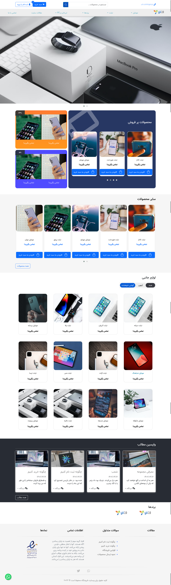
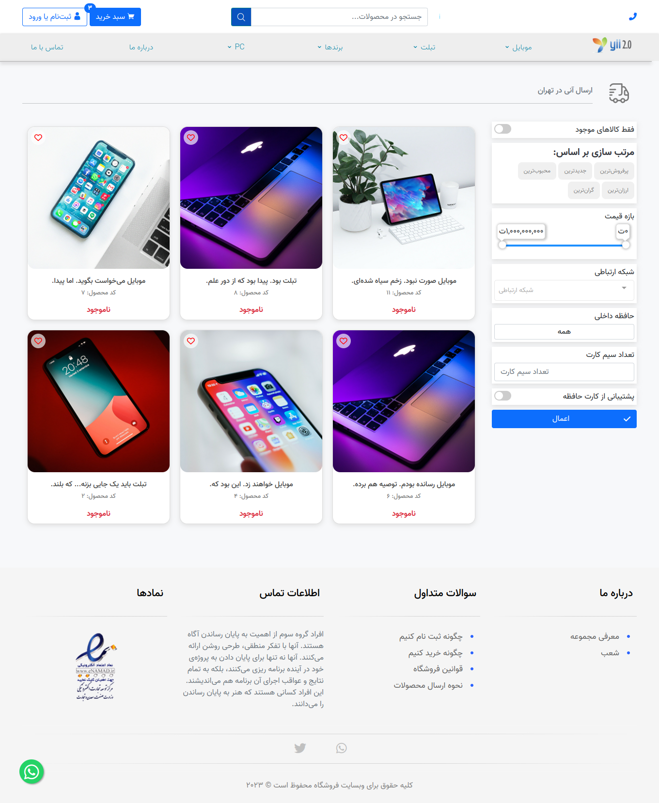
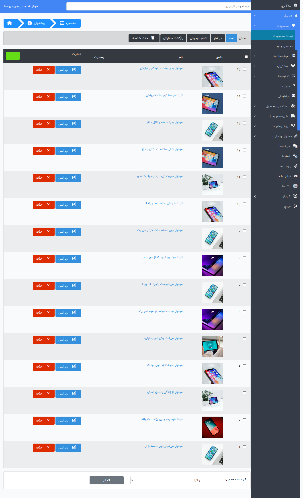

<div align="center">
    
</div>

#xShop

x-shop is an open source shop developed in laravel, very customizable!

## xshop features

- Product category manager
    - product categories tree 
    - product category sotable
    - product category metable
    - product category image + thumbnail
- Product manager
    - product fields
        - name 
        - base price
        - main category
        - categories
        - sku code
        - abstract
        - description
        - tags
    - product quantity + managing store
    - product discount
    - product multi images +  thumbnail
    - product metable
-  orders & invoice
- customer & clients
    - multi address
    - can define clients as colleague
    - customer control panel
- question and answer 
- ticking system
- transport manager
- meta properties
- post manager
- post categories
- gallery manager
- nav menu manager
- slider & carousel manager
- comments manager
- settings
- attachment system
- admins logs  
- user & admin mananger
- polling system
- advertise system
- supported pay gateways:
    - zarinpal
    - zibal
    - pay.ir  
    - saderat bank
    - melat bank
    - parsian bank
- & etc, like as customzied search and compare products

## License
xShop developed under `GPL-3` license, So don't worry it will be opensource for ever!

[](https://opensource.org/licenses/GNU)


[GPL](https://www.gnu.org/licenses/gpl-3.0.en.html)

## Develop guide

### Requirement

- php 8.1
- mysql or mariadb
- composer

### Development config & commands

Create new database and rename `.env.example` to `.env` then update you `.env` configs so run this commands:

```bash
git clone  https://github.com/4xmen/xshop.git 
cd xshop
composer install
php artisan migrate --seed
php artisan storage:link
php artisan serv
```
now login to admin panel `http://localhost:800/dashboard` default admin email is : `admin@example.com` and default password is: `password`


# Deploy guide

We recommend deploy xshop on VPS, so create databse and run this commands

```bash
cd /home/[yourUsername]/[pathOfYourWebsitePublicHTML]
git clone  https://github.com/4xmen/xshop.git . # if this command not work make empty this folder
cp .env.example .env
nano .env # edit your config db, url, etc.
composer install
php artisan migrate
php artisan db:seed --class=UserSeeder
php artisan db:seed --class=SettingSeeder
nano .env # make APP_DEBUG false, APP_ENV production
php artisan storage:link
composer install --optimize-autoloader --no-dev
```

## contribute & support

We are so pleased to your help and help you, If you wanna develop xshop, Congrats or 
if you have problem, don't worry create an issue here:

```
https://github.com/4xmen/xshop/issues
```

## Screen shots








<div align="center"> Developed With Love ! ❤️</div>
